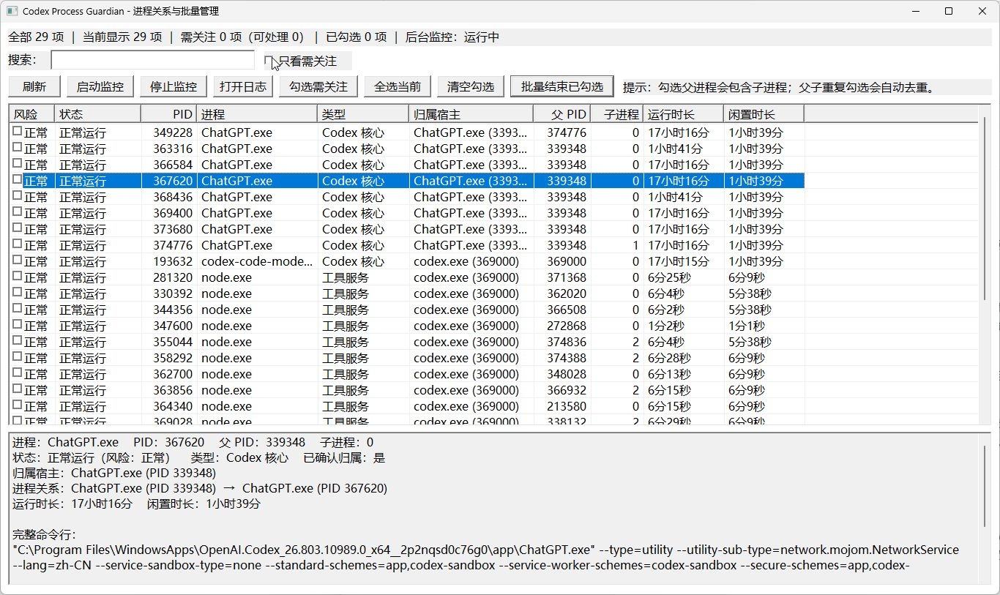

# Codex Process Guardian

[](https://github.com/wf1woi/codex-process-guardian/actions/workflows/ci.yml)
[](https://github.com/wf1woi/codex-process-guardian/releases/latest)
[](https://github.com/wf1woi/codex-process-guardian)
[](https://www.rust-lang.org/)

面向 ChatGPT 与 Codex 桌面环境的轻量级 Windows 进程监控工具。它用于识别浏览器自动化、MCP、CUA runtime 等工具调用结束后可能遗留的后台进程，并提供进程关系查看、搜索筛选和安全批量管理。

> 默认只监控和报告，不会自动结束进程。任何手动终止操作都需要明确确认。

## 界面预览



主表用于快速比较风险、状态、PID、宿主关系和运行时间；选择一行后，下方详情区会展示完整进程关系与实时命令行。截图中的进程和数值仅为运行示例，会随系统环境变化。

## 下载

前往 [Releases](https://github.com/wf1woi/codex-process-guardian/releases/latest) 下载：

- `codex-process-guardian-windows-x64.zip`：完整运行包，推荐使用。
- `guardian.exe`：原生图形界面。
- `guardian-cli.exe`：终端管理器。

支持 Windows 10/11 x64，无需安装 .NET、Node.js、Python 或 PowerShell 常驻服务。

## 主要功能

- 原生 Rust + Win32 实现，无 WebView、WMI 常驻和异步运行时。
- 识别 ChatGPT/Codex 关联的浏览器、MCP、AgentMemory、CodeGraph 和 CUA runtime 进程。
- 显示风险、状态、PID、父 PID、子进程数、归属宿主、运行时长和闲置时长。
- 展示“宿主 → 启动器 → 当前进程”的完整关系路径及实时命令行。
- 支持按 PID、名称、类型、状态、宿主、关系路径和命令行搜索。
- 支持复选框多选、勾选关注项、全选当前结果和批量操作。
- 父子进程重复选择会自动去重；选择父进程时会处理对应进程树。

## 快速开始

1. 下载并解压 `codex-process-guardian-windows-x64.zip`。
2. 双击 `guardian.exe`。
3. 保持默认的“只看需关注”，或使用搜索框查找进程。
4. 单击一行查看完整关系和命令行。
5. 如需处理多个进程，勾选目标后点击“批量结束已勾选”，核对影响范围并确认。

启动后台监控可点击界面中的“启动监控”，也可以运行：

```powershell
./guardian.exe --watch
```

安全停止后台监控：

```powershell
./guardian-cli.exe --stop-watch
```

## 安全设计

- 默认配置为 `action=report`，只报告，不自动清理。
- 只有监控器实际观察到属于 ChatGPT/Codex 宿主树的进程，才会被标记为已确认归属。
- 终止前在同一个进程句柄上复核创建时间，降低 PID 复用导致误操作的风险。
- 发出终止请求后等待对应句柄确认退出，不依赖固定延迟或重复全系统快照。
- GUI 和 CLI 的手动终止均需要明确确认；归属未确认的进程会被拒绝。
- 状态文件不保存完整命令行；命令行只在实时扫描和当前界面中使用。
- 状态文件采用原子替换；扫描失败不会覆盖已有归属历史。
- GUI 扫描失败时会明确标记当前列表为“上次成功快照”。

## 配置

编辑程序同目录的 `guardian.conf`：

| 配置项 | 默认值 | 说明 |
|---|---:|---|
| `interval_seconds` | `30` | 后台扫描间隔，最低 5 秒 |
| `grace_minutes` | `5` | 宿主退出后的清理宽限期 |
| `owned_browser_idle_minutes` | `20` | 宿主在线时浏览器闲置告警阈值 |
| `owned_tool_idle_minutes` | `30` | 宿主在线时工具服务闲置告警阈值 |
| `action` | `report` | `report` 仅报告；`terminate` 允许自动清理 |
| `terminate_owned_idle_browser` | `false` | 是否自动处理宿主在线的闲置浏览器 |
| `terminate_owned_idle_tool` | `false` | 是否自动处理宿主在线的闲置工具服务 |

建议先保持默认配置观察一段时间，再决定是否启用任何自动终止选项。

## 数据文件

运行状态和事件日志位于：

```text
%LOCALAPPDATA%\CodexProcessGuardian
```

- `state-rust.tsv`：进程身份、归属、分类和活动状态。
- `events-rust.log`：状态变化、监控错误和终止结果。

## 性能目标

项目优先保证低常驻开销：

- Release 可执行文件约 300 KB。
- GUI 私有内存通常低于 12 MB。
- 当前开发机热扫描平均约 140 ms。
- 扫描间隔内使用内核事件等待，不进行忙轮询。

实际数据会随系统进程数量、权限和 Windows 版本变化。

## 登录启动

运行 `Install-StartupTask.ps1` 可为当前用户创建登录启动任务。脚本执行前会显示影响范围并要求中文确认。

卸载登录任务：

```powershell
./Remove-StartupTask.ps1
```

卸载任务不会删除状态和日志文件。

## 从源码构建

要求：Windows 10/11、Rust stable MSVC toolchain。

```powershell
cargo check
cargo test
cargo build --release
```

构建产物位于 `target/release/`。

## 参与贡献

请阅读 [CONTRIBUTING.md](CONTRIBUTING.md)。安全问题请按照 [SECURITY.md](SECURITY.md) 私下报告，不要在公开 Issue 中披露可利用细节。

## 许可证

项目当前尚未声明开源许可证。在许可证确定之前，源代码可公开查看，但不代表已授予复制、修改或再分发权利。
